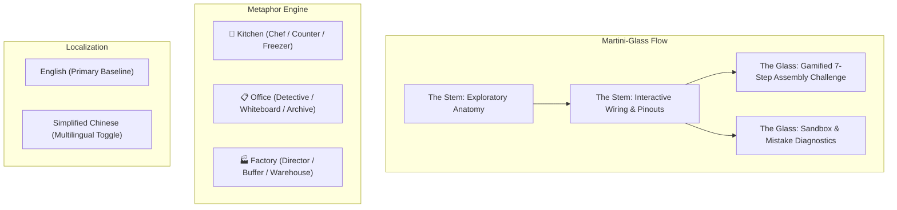

# PC Explorer: Interactive Hardware Learning Platform
### Visual Design, Webpage Layout, Pedagogical Content & Implementation Roadmap

> **Status:** ✅ Completed & Deployed Locally  
> **Target Audience:** PC building beginners, tech enthusiasts, STEM students, and visual learners.  
> **Repository:** `/home/q/Projects/pc_part_exp`  
> **Design Pattern:** Martini-Glass Narrative Structure (Guided Anatomy & Wiring -> Open Sandbox / 7-Step Assembly)

---

## 1. Architectural Decisions (Implemented)

1. **Rendering Engine**: **High-Precision 2.5D Isometric SVG & Canvas Engine**
   - Sub-50KB bundle, zero 3D loading delays, retina-crisp rendering at all zoom levels.
   - Native DOM event triggers (hover, focus, click), accessible ARIA nodes, and reactive SVG layer glows.
2. **Pedagogical Narrative Model**: **Martini-Glass Structure**
   - **Phase 1 (The Stem - Guided Discovery)**:
     - *Exploratory Anatomy*: Hover/click motherboard sockets to inspect part shapes, orientations, and roles.
     * *Wiring & Signal Tracing Lab*: Trace electrical paths (24-pin, 8-pin EPS, PCIe, SATA) and front-panel pinouts.
   - **Phase 2 (The Wide Glass - Open Sandbox & Challenge)**:
     - *Gamified 7-Step Assembly Simulator*: Hands-on interactive build sequence with drop targets, latch snaps, and mistake diagnostics.
3. **Multi-Analogy Engine (Metaphor Switcher)**:
   - Dynamic toggle on the interface allowing users to switch between conceptual metaphors:
     - 🍳 **The High-End Kitchen**: CPU = Head Chef | RAM = Prep Counter / Cutting Board | SSD = Cold Walk-in Freezer | GPU = Brigade of 5,000 Plating Artists | Motherboard = Kitchen Counters & Utilities | PSU = Gas & Power Main | Cooler = Exhaust Hood
     - 📋 **The Detective Office**: CPU = Lead Detective | RAM = Giant Working Whiteboard (holds active clues, wiped clean at night) | SSD = Basement Archive Vault | GPU = Forensic Sketch Artist Squad | Motherboard = Building Intercom & Corridors | PSU = Power Substation | Cooler = Desk Fans & Ventilation
     - 🏭 **The Automated Factory**: CPU = Plant Director | RAM = High-Speed Conveyor Buffer | SSD = Automated Central Warehouse | GPU = Parallel Robotic Arm Array | Motherboard = Factory Floor & Power Conduits | PSU = Main Transformer | Cooler = Cooling Towers
4. **Internationalization (i18n) Foundation**:
   - English (`en`) built as the primary baseline.
   - Simplified Chinese (`zh`) fully implemented with complete translations for all components, analogies, pins, and diagnostics.
   - Instant language toggle on the top navigation bar.

---

## 2. Pedagogical Architecture: Component Matrix & Multiple Analogies

| Component | Physical Shape & Landmarks | Motherboard Location & Orientation | Kitchen Analogy 🍳 | Detective Office Analogy 📋 | Automated Factory Analogy 🏭 | Physical Connection & Keying | Beginner Trap / Gotcha |
| :--- | :--- | :--- | :--- | :--- | :--- | :--- | :--- |
| **CPU** (Processor) | Square flat package, nickel-plated copper lid (IHS), gold contacts (LGA) or pins (PGA), alignment notches & gold corner triangle. | Center-top of motherboard, inside LGA1700/AM5 socket with lever arm. | **Master Chef**: Rapid decision maker, directs orders, holds very little food in hand. | **Lead Detective**: Analyzes clues, solves logic puzzles, makes arrests. | **Plant Director**: Coordinates shifts, schedules work, issues immediate directives. | **Zero-Insertion Force (ZIF)**: Drops in flat without pushing; retention arm locks down. | **Bent Pins**: Never force down. Align golden triangle corner with socket dot. |
| **CPU Cooler & Paste** | Heavy heatsink with copper heatpipes, aluminum fins, and 120/140mm fan or AIO water pump. | Bolted directly over CPU through motherboard mounting holes with backplate. | **Kitchen Range Hood / AC**: Expels extreme cooking heat so the chef doesn't faint. | **Office Air Conditioning & Ventilation**: Prevents room from becoming an unlivable sauna. | **Cooling Tower**: Dissipates high thermal waste from high-speed processing. | 4-point screw mounting bracket + 4-pin PWM `CPU_FAN` or `AIO_PUMP` header. | **Peel the Plastic Film!** Leaving transparent sticker on heatsink base causes instant thermal throttling. |
| **RAM** (Memory) | Slender circuit board with memory ICs, aluminum heat spreader, edge connector with offset keying notch. | 2–4 vertical DIMM slots directly to the right of the CPU socket. | **Prep Counter / Cutting Board**: Workspace for active ingredients. Cleared completely at end of shift. | **Giant Whiteboard**: Active clues and suspect photos. Erased completely when lights go out (volatile). | **Conveyor Buffer**: Holds raw parts ready for immediate assembly line stamping. | Straight down press into keyed DIMM slot until retention latches snap with audible click. | **Dual-Channel Slots**: Put 2 sticks in slots 2 and 4 (A2/B2), not 1 and 2, for double data throughput. |
| **Storage (M.2 NVMe SSD)** | Gum-stick sized board (2280 = 22x80mm), flash NAND controller, rear semicircle screw notch. | Directly on motherboard between CPU and PCIe slots, often under metal heatsink armor. | **Walk-in Freezer / Pantry**: Long-term storage of all bulk ingredients. Remains intact when power shuts off. | **Basement Archive Vault**: Steel file cabinets with all historical cases. Permanent records. | **Central Warehouse**: Pallets of stored stock. Slower to fetch than buffer, but never lost. | Insert at 30° angle into M.2 M-Key slot, press down flat, tighten standoff screw. | Missing standoff screw underneath will crack the PCB when tightened! Peel M.2 shield thermal pad film. |
| **GPU** (Graphics Card) | Massive dual/triple-slot card with fans, vapor chamber, aluminum backplate, display bracket (HDMI/DP). | Primary top PCIe x16 slot, bolted to rear expansion bracket of chassis. | **Brigade of 5,000 Plating Artists**: Does not cook recipes, but paints millions of dishes simultaneously. | **Forensic Sketch & Surveillance Squad**: Instantly scans thousands of video frames and draws images in real time. | **Parallel Robotic Arm Array**: Thousands of identical micro-actuators painting and stamping sheet metal in parallel. | PCIe x16 slot with rear lock clip + 1 to 3 8-pin PCIe / 12VHPWR cables from PSU. | **Plug monitor cable into GPU, NOT Motherboard!** Plugging into motherboard uses weak integrated graphics. |
| **Motherboard** | Full-sized ATX (305x244mm) PCB with multi-layer copper traces, capacitors, VRMs, and chipset. | Screwed to case chassis standoffs; grounds and connects all components. | **Kitchen Floor Plan & Utilities**: Plumbing, gas lines, electric conduits, and walkways connecting all stations. | **Office Building & Intercom**: Corridors, elevators, phone lines, and desks connecting the entire agency. | **Factory Floor & Conveyor Network**: Physical infrastructure and power distribution lines linking all stations. | 24-pin ATX main power + 8-pin CPU EPS + data buses (PCIe, DMI, SATA, USB). | **Standoff Screws**: Motherboard must sit on brass standoffs, never directly on case metal, to prevent dead shorts. |
| **Power Supply** (PSU) | Heavy steel enclosure with 120mm intake fan, AC rocker switch, modular / fixed cable bundle. | Bottom basement compartment of chassis, fan facing bottom dust filter. | **City Gas & Municipal Power Hookup**: Takes wild 110V/230V AC current and converts it into clean DC lines. | **Substation Transformer**: Steps down high-voltage city grid into safe 12V/5V/3.3V currents for office equipment. | **Plant Power Substation**: Central regulated generator feeding heavy 12V lines to heavy machinery. | Keyed multi-pin cables (24-pin ATX, 8-pin EPS, 6+2 PCIe, SATA). | **Never mix modular cables from different brands!** The PSU-side pinouts are NOT standardized and will fry parts. |
| **Case Fans & Airflow** | 120mm/140mm square fans with directional blade curvature and housing flow arrows. | Front/bottom intake, rear/top exhaust to form a positive or neutral pressure tunnel. | **Exhaust Blowers**: Keeps kitchen fresh, evacuates grease and heat away from dining area. | **HVAC Air Duct System**: Circulates fresh conditioned air and vents stale heat outside. | **Factory Ventilation Ducts**: Ensures clean air intake and removes fumes from hot equipment. | 4-pin PWM header (`CHA_FAN` / `SYS_FAN`) for software RPM speed control. | **Fan Direction**: Air always flows towards the cage/bracket side. Check the arrow on the side of the plastic frame. |

---

## 3. Implementation Roadmap & Milestone Tracker

### Milestone 0: Project Scaffolding & Architecture Foundations
- [x] Initial design specification & pedagogical architecture defined
- [x] Initialize repository with Vite, React 19, TypeScript, and TailwindCSS
- [x] Set up theme tokens (Cyber-Slate, Circuit Teal, Ember Orange, Neon Emerald, Violet)
- [x] Configure `i18n` dictionary structure (`src/i18n/`) with English baseline
- [x] Implement data models (`src/data/partsData.ts`, `src/data/motherboardData.ts`, `src/data/wiringData.ts`, `src/data/assemblyData.ts`)

### Milestone 1: Interactive Motherboard Vector Engine & Anatomy Explorer (The Stem)
- [x] Render high-precision SVG ATX Motherboard (LGA socket, 4 DIMMs, 2 M.2, 2 PCIe x16, VRMs, 24-pin, SATA, Front Panel)
- [x] Implement reactive socket hover & focus glow states
- [x] Implement viewport canvas controls (Zoom in/out, Pan, Reset view)
- [x] Build Motherboard Layer Switcher (All, Power lines, High-speed PCIe traces, Cooling clearance, I/O)
- [x] Build Part Inspector Drawer with tabbed breakdown (Shape Anatomy, Analogy Card, Connection Specs, Gotchas)
- [x] Build bottom component selector carousel

### Milestone 2: Multi-Metaphor Engine & Tactile Connection Inspector
- [x] Implement Metaphor Switcher toggle in header (🍳 Kitchen vs. 📋 Detective Office/Whiteboard vs. 🏭 Factory)
- [x] Build 2.5D visual component card with pinout & notch indicators (CPU golden triangle, RAM offset notch, PCIe latch)
- [x] Add interactive tactile audio & feel descriptions for each socket engagement

### Milestone 3: Interactive Wiring & Signal Tracing Lab
- [x] Build animated SVG cable overlay connecting PSU, Motherboard, CPU, GPU, and Storage
- [x] Create interactive Front Panel Header guide (demystifying `POWER_SW`, `RESET_SW`, `HDD_LED`, `POWER_LED`)
- [x] Implement modular cable validator (explaining why PSU-side cables cannot be mixed across brands)

### Milestone 4: Gamified 7-Step Assembly Challenge (The Martini Glass)
- [x] Build 7-step guided assembly workflow (CPU -> RAM -> M.2 -> Cooler -> Case Mount -> GPU -> Cabling)
- [x] Implement interactive click-to-seat simulation with validation checks and confetti celebration
- [x] Implement "Diagnostic Mode / What Happens If I Do It Wrong?" error simulator:
  * Monitor in Motherboard instead of GPU -> Black screen / Low FPS warning
  * RAM in single channel (Slots 1 & 2) -> Half bandwidth warning
  * Plastic film left on cooler -> 100°C Thermal throttle alert
  * Disconnected Power Button -> Dead button warning
  * PSU Rocker Switch off -> No standby power warning

### Milestone 5: Localization & Polish
- [x] Activate Language Switcher toggle (English `EN` and Simplified Chinese `中文`)
- [x] High-performance production bundle built with 0 errors (sub-1s Vite compile)
